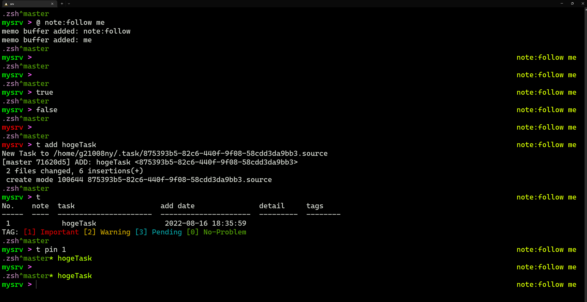

# .zsh



My ZSH Configuration

## Abst.

- zsh my settings
- automatic update conf using `git pull` in background.
- no third-party extensions(e.g. oh-my-zsh)
- custom-shell-extension in `custom-available.d/` ( symlink to `custom-enable.d/`) [EXTENSIONS.md](EXTENSIONS.md)
- Simple Inline Note (called `memo, @`)  extension
- Simple Task Manager with git

FUTURE: [see FUTURE.md](FUTURE.md)

## Dependency(Alias)

- zsh(checked:`zsh 5.4.2 (x86_64-ubuntu-linux-gnu)`)
- perl
- git
- go (gen uuid)

## Install

Only 5 steps.

```sh
cd

git clone https://github.com/anya-tokugawa/.zsh

cd ~/.zsh

chmod x INSTALL.sh

./INSTALL.sh [workspace name] [wttr weather location name]
# auto replace to bash to zsh.(not chsh)
```

## Feature

### Task Manage

```
% tadd [TaskName]
% tadd [TaskName] [MoreText]
---
% t
No.    task              add date               detail
-----  ------------      ---------------------  ---------
1      Apo               2020-10-06 16:13:20
2      StudentAssitant   2020-10-06 16:19:48    UNIX/Database
3      Parttime Job      2020-10-06 16:29:47
---
% tdone 3
done Parttime Job
% tdel 1
deleted Apo
% tsync
> sync via git
----
```

### Memo Feature

`@`Command is for prompt-note.

```sh
% @ Hello World
memo buffer added: Hello
memo buffer added: World
%                                Hello World
% @ -Hello                       Hello World
memo buffer removed: Hello
%                                      World
% @ GoodMorning World                  World
memo buffer added: GoodMorning
memo buffer exist: World
%                           World GoodMorning
% @ -World
% @write                          GoodMorning
memo: add - GoodMorning
% cat ~/.zsh/MEMO.txt
001:| GoodMorning
% @write
memo: exist - GoodMorning
```

### Other Plugins

- enable Plugin

```sh
cd .zsh
./util.d/enablePlugin.sh custom-available.d/[Plugin_File_name]
# or, TUI
./util.d/manager.sh
```

#### AutoCloseConsoleChecker(A3C) - `autoCloseConsole.sh`

If it is not running when bowling 4 count per 30sec,
auto-close terminal(`kill -9 $TERMINAL_PID`)

- `autoexit` ... enable A3C
- `noautoexit` ... disable A3C

#### WSL - Windows StartupDir Detection - `wsl-autocd-detectWinStartup.sh`

If you run WSL by AutoHotKey(etc...) at Windows StartupDir,
this feature detected and change-directory to HomeDir.

#### terminal Timer - `termTimer.sh`

- Timer in background using `sleep`
- usage: `timer [sleep_secounds]`
- store running timer info to `~/.timer.csv`
- list running timer: `lstimer`

#### sudo aliases - `sudo.sh`

- if `sudo apt`: -> alias to `apt-fast`
- else: `sudo [other_args]`

#### alias alnativeTool `changeAlternativeTools.sh`

when hasCommand, aliasd ....

- `find` -> `fd`
- `cat`  -> `bat`
- `ls`   -> `exa`
- `apt`  -> `apt-fast`

#### dstask aliases - `dstask.sh`

- dstask custom command

```
$2 ... sh || show
$3 ... and

d sh pr || pro      ... dstask show-projects
d    ta || tags     ...            -tags
d    ac || now      ...            -active
d    pa || stopped  ...            -paused
d    re || resolved ...            -resolved
d    un || untagged ...            -organised
```

- else: `dstask [other_args]`

#### WSL Notify to Windows

More Description: https://qiita.com/anshz0802/items/1c317220f03319a64d2a

#### Others

- custom terminal startup shellscript can store to `custom.d/`(git ignored)

##### Performance

- init: `0.7653s`

## Design


